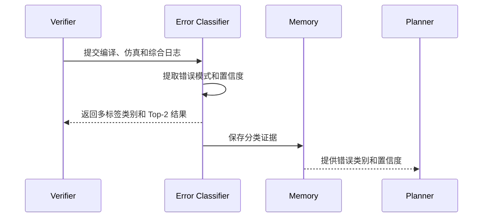

# Error Classifier

```mermaid
sequenceDiagram
    participant Verifier
    participant Classifier as Error Classifier
    participant Memory
    participant Planner

    Verifier->>Classifier: 提交编译、仿真和综合日志
    Classifier->>Classifier: 提取错误模式和置信度
    Classifier-->>Verifier: 返回多标签类别和 Top-2 结果
    Classifier->>Memory: 保存分类证据
    Memory-->>Planner: 提供错误类别和置信度
```
