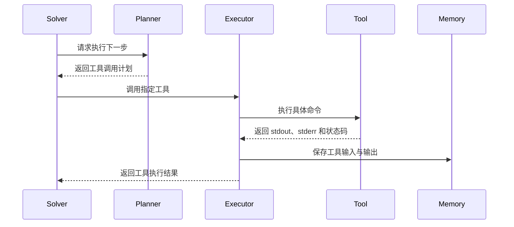

# Executor

```mermaid
sequenceDiagram
    participant Solver
    participant Planner
    participant Executor
    participant Tool
    participant Memory

    Solver->>Planner: 请求执行下一步
    Planner-->>Solver: 返回工具调用计划
    Solver->>Executor: 调用指定工具
    Executor->>Tool: 执行具体命令
    Tool-->>Executor: 返回 stdout、stderr 和状态码
    Executor->>Memory: 保存工具输入与输出
    Executor-->>Solver: 返回工具执行结果
```
