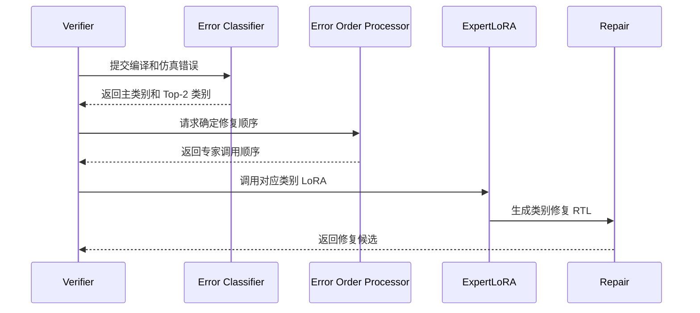

# Expert LoRA

```mermaid
sequenceDiagram
    participant Verifier
    participant Classifier as Error Classifier
    participant Order as Error Order Processor
    participant ExpertLoRA
    participant Repair

    Verifier->>Classifier: 提交编译和仿真错误
    Classifier-->>Verifier: 返回主类别和 Top-2 类别
    Verifier->>Order: 请求确定修复顺序
    Order-->>Verifier: 返回专家调用顺序
    Verifier->>ExpertLoRA: 调用对应类别 LoRA
    ExpertLoRA->>Repair: 生成类别修复 RTL
    Repair-->>Verifier: 返回修复候选
```
