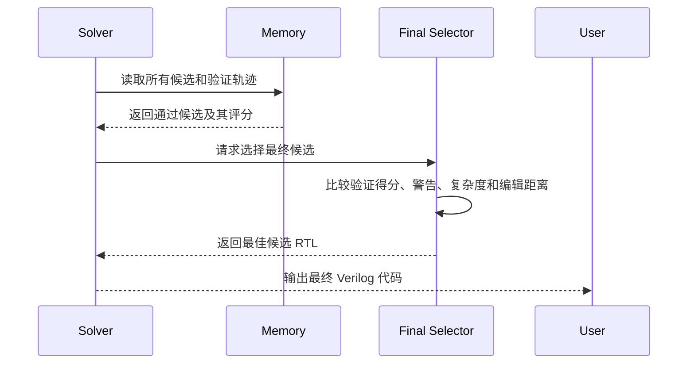

# Final Selector

```mermaid
sequenceDiagram
    participant Solver
    participant Memory
    participant Selector as Final Selector
    participant User

    Solver->>Memory: 读取所有候选和验证轨迹
    Memory-->>Solver: 返回通过候选及其评分
    Solver->>Selector: 请求选择最终候选
    Selector->>Selector: 比较验证得分、警告、复杂度和编辑距离
    Selector-->>Solver: 返回最佳候选 RTL
    Solver-->>User: 输出最终 Verilog 代码
```
