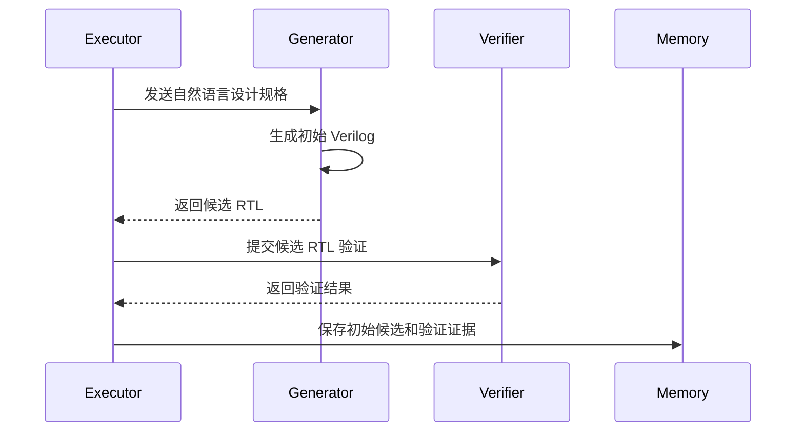

# Generator

```mermaid
sequenceDiagram
    participant Executor
    participant Generator
    participant Verifier
    participant Memory

    Executor->>Generator: 发送自然语言设计规格
    Generator->>Generator: 生成初始 Verilog
    Generator-->>Executor: 返回候选 RTL
    Executor->>Verifier: 提交候选 RTL 验证
    Verifier-->>Executor: 返回验证结果
    Executor->>Memory: 保存初始候选和验证证据
```
