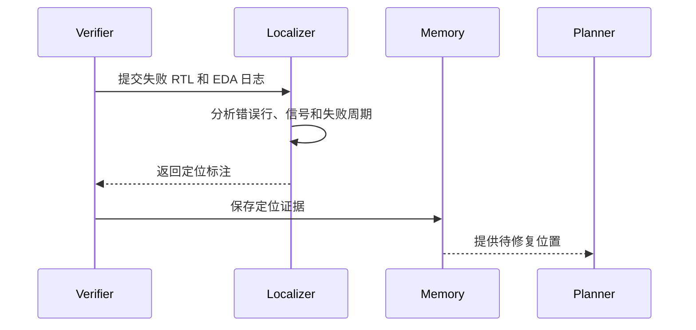

# Localizer

```mermaid
sequenceDiagram
    participant Verifier
    participant Localizer
    participant Memory
    participant Planner

    Verifier->>Localizer: 提交失败 RTL 和 EDA 日志
    Localizer->>Localizer: 分析错误行、信号和失败周期
    Localizer-->>Verifier: 返回定位标注
    Verifier->>Memory: 保存定位证据
    Memory-->>Planner: 提供待修复位置
```
