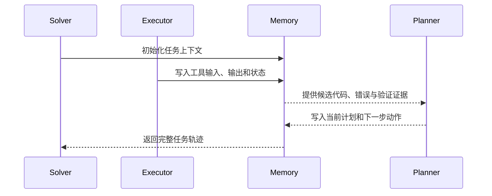

# Memory

```mermaid
sequenceDiagram
    participant Solver
    participant Executor
    participant Memory
    participant Planner

    Solver->>Memory: 初始化任务上下文
    Executor->>Memory: 写入工具输入、输出和状态
    Memory-->>Planner: 提供候选代码、错误与验证证据
    Planner-->>Memory: 写入当前计划和下一步动作
    Memory-->>Solver: 返回完整任务轨迹
```
