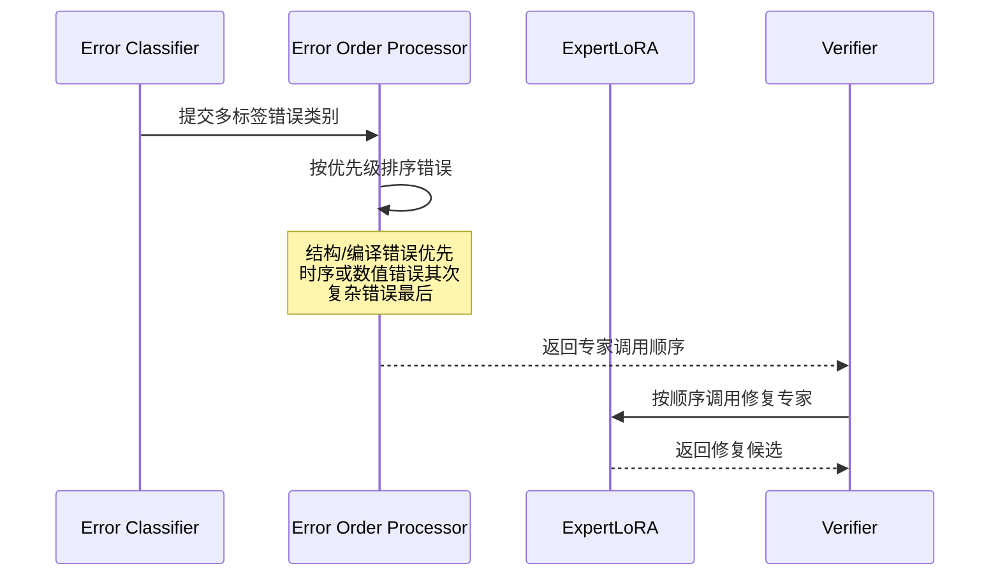

# Error Order Processor

```mermaid
sequenceDiagram
    participant Classifier as Error Classifier
    participant Order as Error Order Processor
    participant ExpertLoRA
    participant Verifier

    Classifier->>Order: 提交多标签错误类别
    Order->>Order: 按优先级排序错误
    Note over Order: 结构/编译错误优先<br/>时序或数值错误其次<br/>复杂错误最后
    Order-->>Verifier: 返回专家调用顺序
    Verifier->>ExpertLoRA: 按顺序调用修复专家
    ExpertLoRA-->>Verifier: 返回修复候选
```
