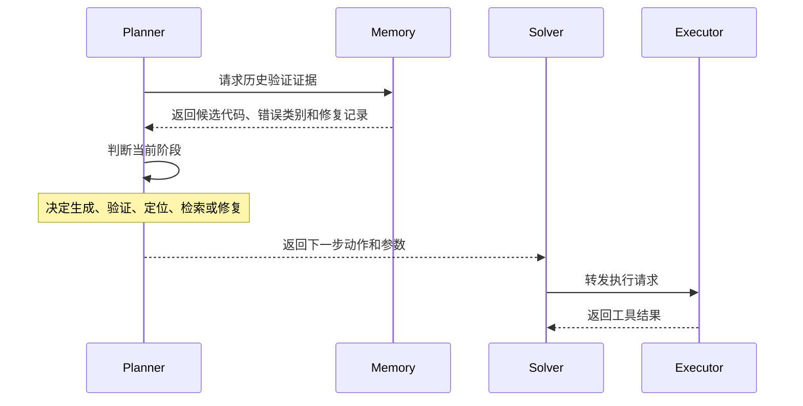

# Planner

```mermaid
sequenceDiagram
    participant Planner
    participant Memory
    participant Solver
    participant Executor

    Planner->>Memory: 请求历史验证证据
    Memory-->>Planner: 返回候选代码、错误类别和修复记录
    Planner->>Planner: 判断当前阶段
    Note over Planner: 决定生成、验证、定位、检索或修复
    Planner-->>Solver: 返回下一步动作和参数
    Solver->>Executor: 转发执行请求
    Executor-->>Solver: 返回工具结果
```
