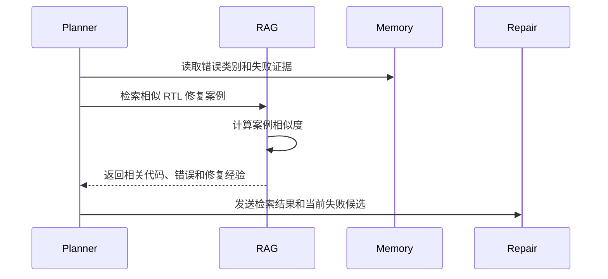

# RAG

```mermaid
sequenceDiagram
    participant Planner
    participant RAG
    participant Memory
    participant Repair

    Planner->>Memory: 读取错误类别和失败证据
    Planner->>RAG: 检索相似 RTL 修复案例
    RAG->>RAG: 计算案例相似度
    RAG-->>Planner: 返回相关代码、错误和修复经验
    Planner->>Repair: 发送检索结果和当前失败候选
```
