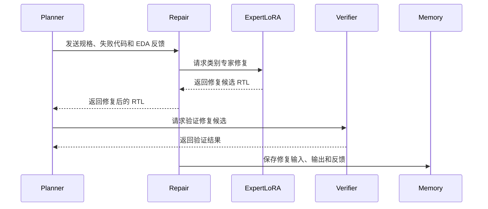

# Repair

```mermaid
sequenceDiagram
    participant Planner
    participant Repair
    participant ExpertLoRA
    participant Verifier
    participant Memory

    Planner->>Repair: 发送规格、失败代码和 EDA 反馈
    Repair->>ExpertLoRA: 请求类别专家修复
    ExpertLoRA-->>Repair: 返回修复候选 RTL
    Repair-->>Planner: 返回修复后的 RTL
    Planner->>Verifier: 请求验证修复候选
    Verifier-->>Planner: 返回验证结果
    Repair->>Memory: 保存修复输入、输出和反馈
```
