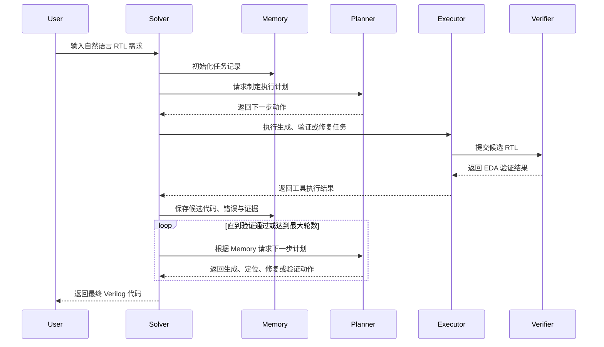

# Solver

```mermaid
sequenceDiagram
    participant User
    participant Solver
    participant Memory
    participant Planner
    participant Executor
    participant Verifier

    User->>Solver: 输入自然语言 RTL 需求
    Solver->>Memory: 初始化任务记录
    Solver->>Planner: 请求制定执行计划
    Planner-->>Solver: 返回下一步动作
    Solver->>Executor: 执行生成、验证或修复任务
    Executor->>Verifier: 提交候选 RTL
    Verifier-->>Executor: 返回 EDA 验证结果
    Executor-->>Solver: 返回工具执行结果
    Solver->>Memory: 保存候选代码、错误与证据
    loop 直到验证通过或达到最大轮数
        Solver->>Planner: 根据 Memory 请求下一步计划
        Planner-->>Solver: 返回生成、定位、修复或验证动作
    end
    Solver-->>User: 返回最终 Verilog 代码
```
