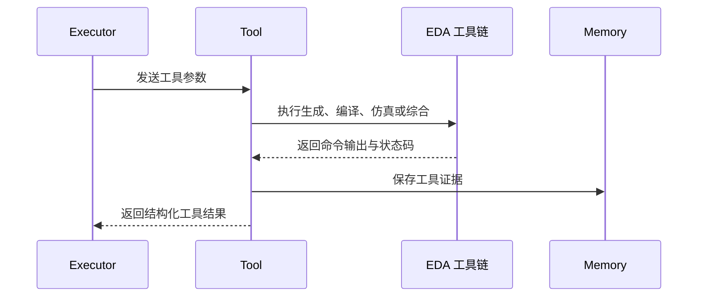

# Tool

```mermaid
sequenceDiagram
    participant Executor
    participant Tool
    participant EDA as EDA 工具链
    participant Memory

    Executor->>Tool: 发送工具参数
    Tool->>EDA: 执行生成、编译、仿真或综合
    EDA-->>Tool: 返回命令输出与状态码
    Tool->>Memory: 保存工具证据
    Tool-->>Executor: 返回结构化工具结果
```
