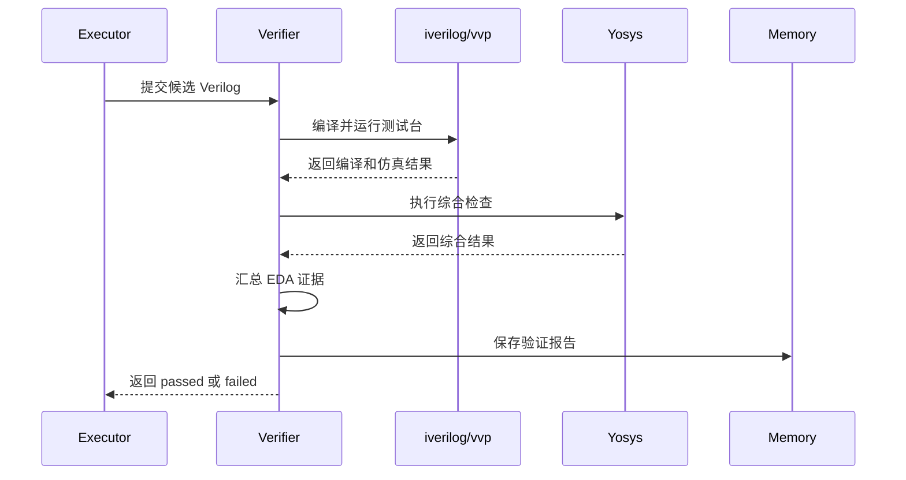

# Verifier

```mermaid
sequenceDiagram
    participant Executor
    participant Verifier
    participant Icarus as iverilog/vvp
    participant Yosys
    participant Memory

    Executor->>Verifier: 提交候选 Verilog
    Verifier->>Icarus: 编译并运行测试台
    Icarus-->>Verifier: 返回编译和仿真结果
    Verifier->>Yosys: 执行综合检查
    Yosys-->>Verifier: 返回综合结果
    Verifier->>Verifier: 汇总 EDA 证据
    Verifier->>Memory: 保存验证报告
    Verifier-->>Executor: 返回 passed 或 failed
```
