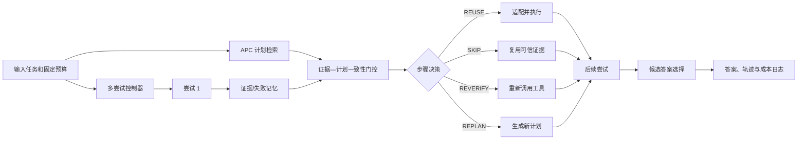

# 固定预算下工具智能体的双层记忆协同研究

## 一 建议论文题目

推荐题目：

**固定预算下工具智能体的双层记忆协同方法研究——跨轨迹证据复用与缓存计划验证**

英文题目：

**Dual-Memory Coordination for Tool-Using Agents under Fixed Budgets: Cross-Trajectory Evidence Reuse and Cached-Plan Validation**

备选题目：

**面向动态工具环境的证据—计划一致性驱动智能体记忆复用方法研究**

论文不再把“多轨迹记忆”或“计划缓存”单独声明为创新，因为相关方法已经分别出现。研究重点收缩为两种不同记忆的协同：证据记忆保存工具实际观察、失败和来源；计划记忆保存 APC 的成功计划模板。核心问题是缓存计划遇到当前证据时，哪些步骤可以复用、跳过、重新验证或必须重新规划，以及这种协同在统一固定预算下是否具有净收益。

## 二 为什么选择这个方向

1. OctoTools 当前以单轨迹的规划—工具调用—验证循环为主，失败后缺少受总预算约束的系统化再次尝试。
2. 当前 APC Shadow 已能检索和保存模板，但命中模板不改变执行；因此存在从“可观察缓存”到“安全辅助规划”的明确工程路径。
3. 多轨迹记忆、反思和计划缓存都可能增加额外 token 与模型调用。只有与预算匹配的原始智能体比较，才能证明实际净收益。
4. 工具返回的原始观察、模型推导的结论、失败经验和计划模板具有不同可信度。把它们混成自然语言历史容易传播错误。
5. 已有研究分别讨论跨轨迹事实、反思、工作流记忆、计划缓存和预算感知，但两层记忆如何在动态工具环境中进行步骤级一致性决策仍可形成具体研究问题。

## 三 与已有研究的边界

必须重点讨论以下工作：

- [ReAct](https://arxiv.org/abs/2210.03629)：建立推理、行动和环境观察交替执行的基础范式。
- [Reflexion](https://arxiv.org/abs/2303.11366)：把失败后的语言反思保存到 episodic memory，指导后续尝试。
- [ExpeL](https://arxiv.org/abs/2308.10144)：从成功和失败经验中抽取跨任务可复用知识。
- [Language Agent Tree Search](https://arxiv.org/abs/2310.04406)：结合 MCTS、环境反馈和反思进行多路径搜索。
- [Agent Workflow Memory](https://arxiv.org/abs/2409.07429)：从历史轨迹归纳并检索可复用工作流。
- [Agentic Plan Caching](https://arxiv.org/abs/2506.14852)：提取、匹配、适配和复用成功计划模板以降低成本与时延。
- [ReasoningBank](https://arxiv.org/abs/2509.25140)：从成功与失败轨迹中蒸馏推理经验，并研究记忆感知测试时扩展。
- [Budget-Aware Tool Use Enables Effective Agent Scaling](https://arxiv.org/abs/2511.17006)：根据剩余工具预算动态选择继续、验证或切换路径。
- [RE-TRAC](https://arxiv.org/abs/2602.02486)：跨轨迹总结证据、不确定性、失败和后续计划。
- [When Does Memory Help Multi-Trajectory Inference for Tool-Use LLM Agents?](https://arxiv.org/abs/2605.28224)：系统比较原始观察、事实提取和反思在 Best-of-N、Beam Search、MCTS 下的效果。
- [Are Online Skill and Memory Modules Always Worth Their Tokens?](https://arxiv.org/abs/2606.15017)：表明记忆模块在 token 匹配基线下不一定优于把预算直接给原始智能体。
- [Fresh Memory, Stale Plans](https://arxiv.org/abs/2609.03340)：研究分布式智能体中共享状态更新后计划失效及依赖范围验证。

本论文不能声称首次提出多轨迹、反思、事实记忆、预算控制或计划缓存。预期贡献应限定为：

1. 为工具智能体定义证据记忆与计划记忆的分层表示及来源关系。
2. 提出面向缓存计划步骤的可解释一致性门控，输出 REUSE、SKIP、REVERIFY、REPLAN。
3. 在同一固定预算和同一基础智能体上，系统测量两类记忆单独与联合使用时的准确率、成本和错误传播。
4. 构建包含证据冲突、证据陈旧、工具不可用和错误缓存命中的受控测试集，测量步骤级决策质量。

## 四 问题定义

### 4.1 四类信息

1. 原始观察：工具实际返回的数据，不自动等于已验证事实。
2. 推导结论：模型根据观察形成的解释或答案，不能反向提升原始证据的可信度。
3. 失败经验：失败工具、失败命令、环境错误和需要避免或重新验证的策略。
4. 计划模板：从成功轨迹抽象出的工具步骤及参数提示，不包含可直接信任的当前事实。

### 4.2 双层记忆

- 证据记忆 `M_e`：记录 evidence_id、来源尝试、来源步骤、工具、子目标、命令、原始结果、可信状态和陈旧状态。
- 计划记忆 `M_p`：记录 APC 模板、来源问题、类别、工具序列与参数提示。

### 4.3 步骤级决策

对于缓存计划中的每个步骤 `p_i`，一致性门控输出：

- `REUSE`：当前没有可替代证据，适配后执行缓存步骤。
- `SKIP`：已有同目标、可信且一致的证据，可以跳过工具调用。
- `REVERIFY`：已有证据失败、陈旧、不可信或彼此冲突，需要重新获取证据。
- `REPLAN`：模板依赖不可用工具或与当前任务明显不兼容，放弃缓存模板。

当前原型采用保守规则门控，后续可以增加 LLM 门控或学习型门控，但规则门控必须保留为低成本、可解释基线。

## 五 系统总体流程

完整执行顺序：

1. 接收问题、环境信息与总预算。
2. 查询 APC，得到命中状态和计划模板，但不直接执行历史命令。
3. 创建独立 Solver 尝试，防止本次轨迹 action 污染下一条轨迹。
4. 从工具 action 中记录带来源的原始观察和失败；模型结论单独保存。
5. 缓存计划命中时，把模板步骤与已有证据交给一致性门控。
6. 将门控决策作为软提示提供给 Planner；当前原型不在 Executor 层强制跳过动作。
7. 在剩余预算内决定继续当前路径或启动新尝试。
8. 对候选答案进行选择并输出完整预算、轨迹、缓存和门控日志。

## 六 研究问题与假设

### RQ1 双层记忆是否优于单独记忆

H1：在固定总预算下，证据记忆与经过验证的计划缓存联合使用，在具有重复工作流和可复用观察的任务上优于仅使用其中一种记忆；在低重复任务上收益可能消失。

### RQ2 步骤级门控能否降低错误复用

H2：与所有缓存步骤都直接 REUSE 相比，证据感知门控能降低错误缓存执行率和重复工具调用，同时保持或提升准确率。

### RQ3 来源、冲突和陈旧标记是否必要

H3：保留 evidence_id、失败状态、可信度和陈旧状态，可以降低错误结论传播；删除这些字段后 SKIP 决策的错误率会上升。

### RQ4 额外记忆处理是否值得其成本

H4：双层记忆并非在所有任务上都有效。其优势主要出现在中高重复度、工具调用昂贵或证据获取成本高的任务中，必须用 token/工具调用匹配基线验证。

### RQ5 预算如何影响最优策略

H5：低预算下计划复用更重要；中等预算下 REVERIFY 更有价值；高预算下启动新轨迹可能更有效。不同预算下不存在统一最优策略。

## 七 当前代码实现

| 模块 | 文件 | 状态 |
|---|---|---|
| 当前轨迹与共享上下文隔离 | `octotools/models/memory.py` | 已实现 |
| Planner 接收分层记忆 | `octotools/models/planner.py` | 已实现 |
| Solver 返回 conclusion、支持共享上下文 | `octotools/solver.py` | 已实现 |
| APC Shadow | `octotools/plan_cache` | 已实现 |
| APC Assist 软提示 | `octotools/solver.py` | 已实现第一版 |
| 多尝试和总步骤/时间预算 | `octotools/research/multi_attempt.py` | 已实现第一版 |
| 观察、失败、摘要消融开关 | `MemorySharingPolicy` | 已实现 |
| 证据来源标识 | `SharedEvidenceMemory` | 已实现第一版 |
| REUSE/SKIP/REVERIFY/REPLAN | `octotools/research/evidence_plan.py` | 已实现规则基线 |
| APC 无门控/有门控消融 | `plan_cache_use_evidence` | 已实现 |
| 模型调用、耗时与估算 token 计量 | `octotools/research/usage.py` | 已实现；token 明确标记为文本估算 |
| 统一实验组入口与 JSONL 日志 | `octotools/research/experiment.py` | 已实现第一版 |
| 硬执行门控 | 无 | 待实现；当前只有 Planner 软提示 |
| 时间语义与自动陈旧判断 | 无 | 待实现 |
| 学习型或 LLM 一致性门控 | 无 | 后续扩展，不作为第一版前提 |

当前规则门控采用工具名与子目标词项重合进行保守匹配。已有匹配失败、陈旧、不可信或结果冲突时输出 REVERIFY；工具不可用时输出 REPLAN；存在单一可信匹配观察时输出 SKIP；否则输出 REUSE。

## 八 实验设计

### 8.1 核心实验组

| 组别 | 轨迹 | 证据共享 | 失败共享 | APC | 证据门控 | 目的 |
|---|---|---|---|---|---|---|
| B0 | 单轨迹 | 否 | 否 | Off | 否 | 原始 OctoTools |
| B1 | 多轨迹 | 否 | 否 | Off | 否 | 测量多次采样本身 |
| M1 | 多轨迹 | 是 | 否 | Off | 否 | 测量原始观察共享 |
| M2 | 多轨迹 | 是 | 是 | Off | 否 | 测量失败信息价值 |
| P0 | 多轨迹 | 是 | 否 | Assist | 否 | 测量无证据门控的计划辅助 |
| P1 | 多轨迹 | 是 | 否 | Assist | 是 | 测量步骤门控本身 |
| C1 | 多轨迹 | 是 | 是 | Assist | 是 | 测量双层记忆组合 |
| C2 | 多轨迹 | 是 | 是 | Assist | 是＋预算策略 | 测量动态预算分配，后期实现 |

Shadow 模式用于记录命中率和建立缓存，不作为改变行为的算法组。

代码配置对应：

- B1：`MemorySharingPolicy(False, False, False)`。
- M1：只设置 `share_observations=True`。
- M2：设置观察和失败为 True。
- P0：`plan_cache_mode="assist"` 且 `plan_cache_use_evidence=False`。
- P1/C1：`plan_cache_mode="assist"` 且 `plan_cache_use_evidence=True`。

### 8.2 数据集和任务类型

主实验至少覆盖三类任务：

1. 知识检索与多跳问答：HotpotQA、2WikiMultiHopQA 或可稳定访问的离线子集。
2. 计算与结构化工具任务：TabMWP、GSM8K 工具增强子集或 OctoTools Calculator 任务。
3. 多工具工作流：StableToolBench、GAIA 可执行子集，或基于 OctoTools 工具构建的可复现实验集。

另外构建一个受控的“证据—计划一致性测试集”，对同一任务生成：

- 新鲜且一致的证据；
- 两个相互冲突的工具结果；
- 显式标记陈旧的证据；
- 失败工具结果；
- 缓存模板要求当前不可用工具；
- 语义相似但实际计划不同的困难负例。

受控集用于评价门控决策，公开数据集用于评价最终任务效果。两者不能混为一个指标。

### 8.3 数据划分和缓存预热

1. 按任务模板或问题族划分开发集、缓存预热集和测试集。
2. 同一问题的改写不能同时出现在预热与测试两侧。
3. 缓存实验必须同时报告冷启动、预热后和持续增长三个阶段。
4. 所有实验组使用相同预热轨迹；不能让某组看到更多成功模板。
5. 动态环境实验记录工具版本、数据时间戳和容器镜像哈希。

### 8.4 预算公平性

至少同时记录并限制：

- Planner/Actor/Verifier/Memory LLM 调用数；
- 输入、输出及缓存 token；
- 工具调用次数；
- 估算 API 费用；
- 墙钟时间。

单轨迹和多轨迹必须共享同一个总预算。例如 B0 最多 12 个工具步骤，B1/M1/M2 的三条轨迹合计也最多 12 步。事实提取、反思、缓存关键词提取和候选答案选择产生的调用必须计入总成本。

设置低、中、高三个预算档，例如 4、8、12 次工具调用，并绘制成功率—成本 Pareto 曲线。不能只选择对提出方法最有利的一个预算。

### 8.5 指标

任务级指标：

1. 准确率、任务成功率、固定预算成功率。
2. 平均成本、成功任务单位成本、平均 token 和工具调用。
3. 时延均值、中位数和 P95。

缓存级指标：

1. 命中率、正确命中率、错误命中率。
2. 命中后准确率变化和缓存冷启动成本。

门控级指标：

1. SKIP precision：被跳过步骤中真正可由已有证据满足的比例。
2. REVERIFY recall：陈旧、冲突或失败证据被要求重新验证的比例。
3. REPLAN recall：不可用或错误模板被放弃的比例。
4. stale-plan execution rate：已失效步骤仍被执行的比例。
5. wrong-evidence propagation rate：错误观察或推导结论影响最终答案的比例。

多轨迹指标：

1. 重复失败率和重复工具调用率。
2. 证据复用率、冲突率、重新验证次数。
3. 至少一个候选正确的 pass@N 与最终选择准确率；两者必须分开报告。

### 8.6 具体实验

实验 E1：B0、B1、M1、M2，回答跨轨迹证据和失败记忆是否有效。

实验 E2：P0、P1，使用受控干预测试门控能否识别一致、冲突、陈旧和不可用工具情形。

实验 E3：B0、M2、P1、C1，在相同总预算下比较单层与双层记忆。

实验 E4：在低、中、高预算下比较各组成本—成功率曲线，检查方法收益是否依赖预算。

实验 E5：按任务类型、缓存命中、工具错误类型和证据冲突类型分层分析。

实验 E6：将规则门控与 LLM 门控比较；LLM 门控的调用成本必须计入预算。只有规则基线稳定后才执行。

### 8.7 统计方法

1. 每个配置使用相同问题顺序、相同模型版本和至少 5 个随机种子。
2. 二元正确性使用 McNemar 检验或配对 bootstrap 置信区间。
3. token、费用和时延报告均值、中位数、分位数及 bootstrap 置信区间。
4. 多重比较使用 Holm 校正。
5. 除显著性外报告绝对提升、相对提升和效应量。
6. 优先使用确定性评测器；必须使用 LLM Judge 时，抽样进行人工复核并报告一致率。

## 九 论文完整流程

### 第一阶段 文献与问题定义

完成相关工作表，逐篇记录任务、记忆粒度、搜索方法、预算、数据集、指标和局限。最终明确本论文不是重新提出跨轨迹记忆，而是研究证据记忆与缓存计划的步骤级协同。

### 第二阶段 基线复现

冻结 OctoTools、模型、工具和容器版本。完成 B0、APC Shadow，并验证缓存预热、命中日志和原始准确率。

### 第三阶段 多轨迹与证据记忆

完成 B1、M1、M2。重点验证跨题隔离、总步数预算和失败信息不会被当成可信事实。

### 第四阶段 计划辅助和一致性门控

完成 P0、P1 和受控一致性测试集。先使用规则门控，再判断是否需要 LLM 门控。

### 第五阶段 成本计量和双层组合

在 Engine、Planner、Verifier、APC 和候选选择器层记录模型调用、token、费用和时延。运行 C1 与预算曲线实验。

### 第六阶段 动态预算策略

只有在前面实验显示双层记忆有稳定收益后，再实现 C2，让控制器在 REVERIFY、新轨迹和重规划之间动态分配剩余预算。

### 第七阶段 结果分析

先回答每个 RQ，再进行总体比较。必须呈现无显著提升和性能下降的任务类型，并分析错误缓存、错误 SKIP、反思误导和候选选择失败。

### 第八阶段 写作与复现材料

整理配置文件、数据划分、缓存快照、随机种子、原始 JSONL 日志、统计脚本和失败案例。论文结论应限定为“在何种任务、证据状态和预算下产生净收益”。

## 十 论文章节结构

1. 绪论：工具智能体的成本、轨迹失败和多种记忆之间的矛盾。
2. 相关工作：ReAct、搜索与反思、经验记忆、工作流/计划缓存、预算感知和计划有效性。
3. 问题定义：轨迹、证据、结论、失败、计划模板、来源和统一预算。
4. 方法：双层记忆、证据—计划门控、多尝试控制和候选选择。
5. 实验设置：数据集、缓存预热、对照组、预算、指标和统计方法。
6. 实验结果：最终效果、门控质量、消融、预算曲线和任务类型差异。
7. 分析与讨论：陈旧计划、错误证据传播、失败记忆副作用、适用边界和威胁效度。
8. 结论：总结在固定预算下双层记忆协同的有效条件与局限。

## 十一 里程碑

1. 已完成：多尝试、证据/失败记忆、APC Shadow、APC Assist、规则一致性门控和消融开关。
2. 下一步：实现统一 token、模型调用和费用统计，生成结构化 JSONL 实验日志。
3. 随后：建立受控一致性测试集并运行 B0、B1、M1、M2、P0、P1。
4. 再后：运行 C1 和三个预算档位的主实验。
5. 最后：根据结果决定是否实现动态预算 C2 或 LLM 门控；Beam Search/MCTS 不作为必需贡献。
